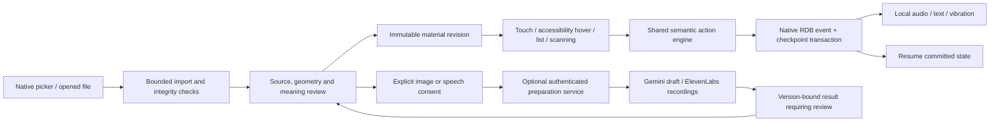

# TouchMap architecture

Prepared by **DEFOZO SOFTWARE HOUSE**, sole team member **Michał Kiełtyka**.

The application owns learner data. The preparation service receives only explicitly selected authoring inputs and never receives learner progress or profiles.

The domain uses source coordinates. Rendering and hit testing use inverse affine viewport transforms. A spatial grid restricts candidate geometry, polygons preserve holes, and line distance supports path-following feedback. Overlap results retain stable selected focus while exposing every hit object.

Each command names stable content IDs, a unique event ID and an expected progress revision. Applying a command is pure. The platform repository commits the event and resulting state together before acknowledging success. A selection is not a submission. Duplicate event IDs do not create another attempt; stale expected revisions fail. Process recovery reads durable state.

The editor clones content and increments its revision. Edits invalidate the affected reviews, recordings and dependent questions. An AI job is bound to source hash and draft revision. Later results cannot replace intervening author edits. Imported author declarations remain separate from receiver acceptance, and byte integrity does not establish factual truth or author identity.

The `.touchmap` container is a ZIP with `manifest.json`, `diagram.json`, a source and audio. Every asset is declared and hashed; learning history and profiles are excluded. Both server and client reject unsafe paths, links, duplicate names, oversized input and malformed contracts. Staged imports are adopted only after validation. The CLI and HTTP service share the Python preparation library.

No cloud database, runtime language-model tutor, vector database, global accessibility service privilege, microphone or location permission is used. Public native APIs provide picker access, local audio playback, optional vibration, lifecycle events, preferences and relational storage. Screen-reader integration and physical vibration require their own runtime evidence.
